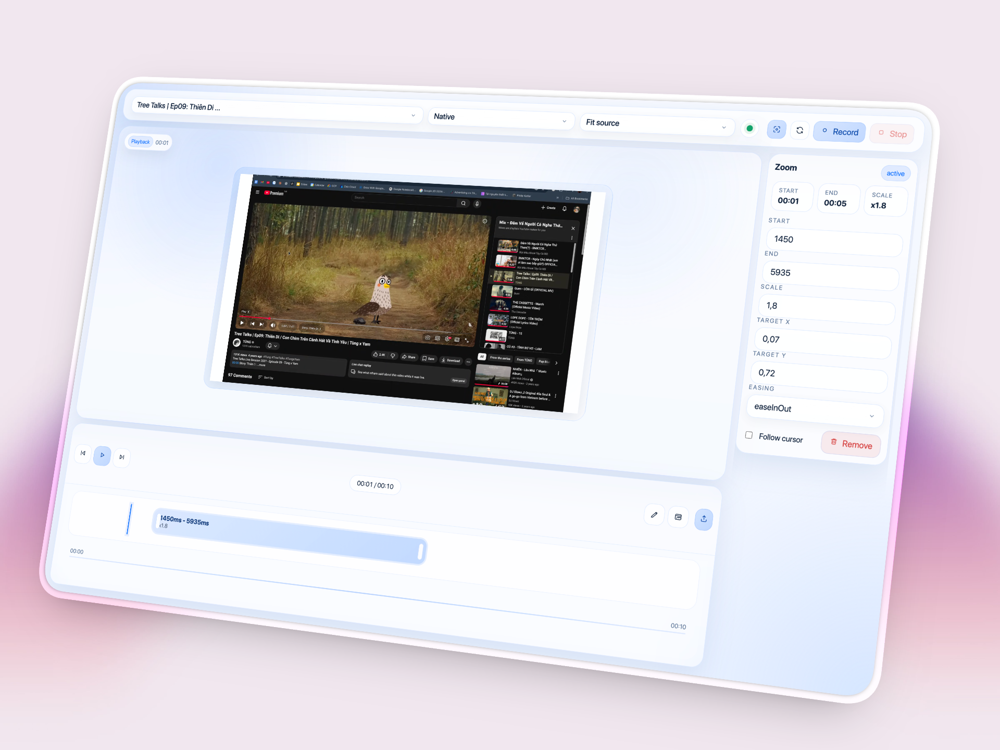

# Shareme



Shareme is a macOS-first Electron app for browser and window recording with editable zooms, local project files, and offline MP4 exports.

## Download for macOS

[Download the latest macOS release](https://github.com/winwin1808/share_me/releases/latest)

Each release attaches a `.dmg` built from a version tag such as `v0.1.0`.

## What it does

- Capture a browser tab, window, or screen on macOS
- Turn clicks into zoom segments and refine them on a timeline
- Adjust crop, browser frame visibility, background, and output ratio
- Save projects locally and reopen them later
- Export MP4 locally with `ffmpeg` and no cloud dependency

## Release flow

1. Update the version in `package.json`.
2. Commit the changes to `main`.
3. Create a tag such as `v0.1.0`.
4. Push the commit and tag.
5. GitHub Actions builds the app and publishes the `.dmg` to GitHub Releases.

## Local development

```bash
npm install
npm run dev
```

## Build and package

```bash
npm run ci:build
npm run package:mac
```

## Unsigned build note

Current releases are unsigned macOS builds. When opening the app for the first time, Gatekeeper may block it.

Use one of these options:

- Right click the app and choose `Open`
- Open `System Settings > Privacy & Security` and use `Open Anyway`

## Signing and notarization later

This repo defaults to unsigned local macOS builds. To enable signing later, provide these GitHub secrets:

- `APPLE_ID`
- `APPLE_APP_PASSWORD`
- `APPLE_TEAM_ID`
- `CSC_LINK`
- `CSC_KEY_PASSWORD`

Then update `build.mac.hardenedRuntime` and notarization hooks as needed.
